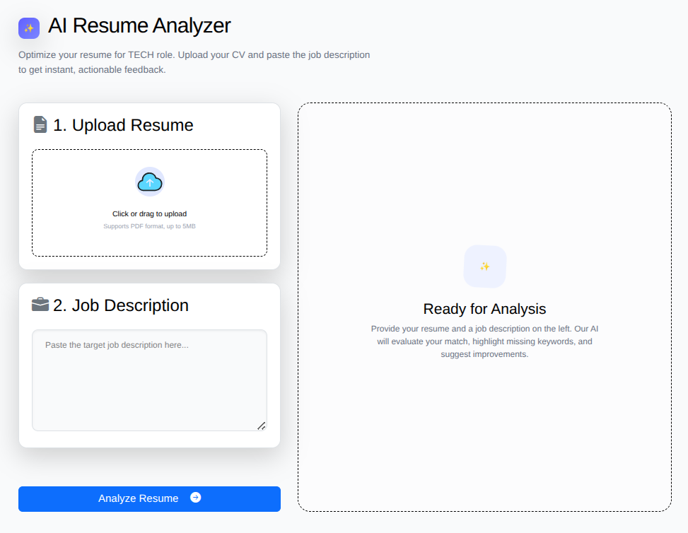
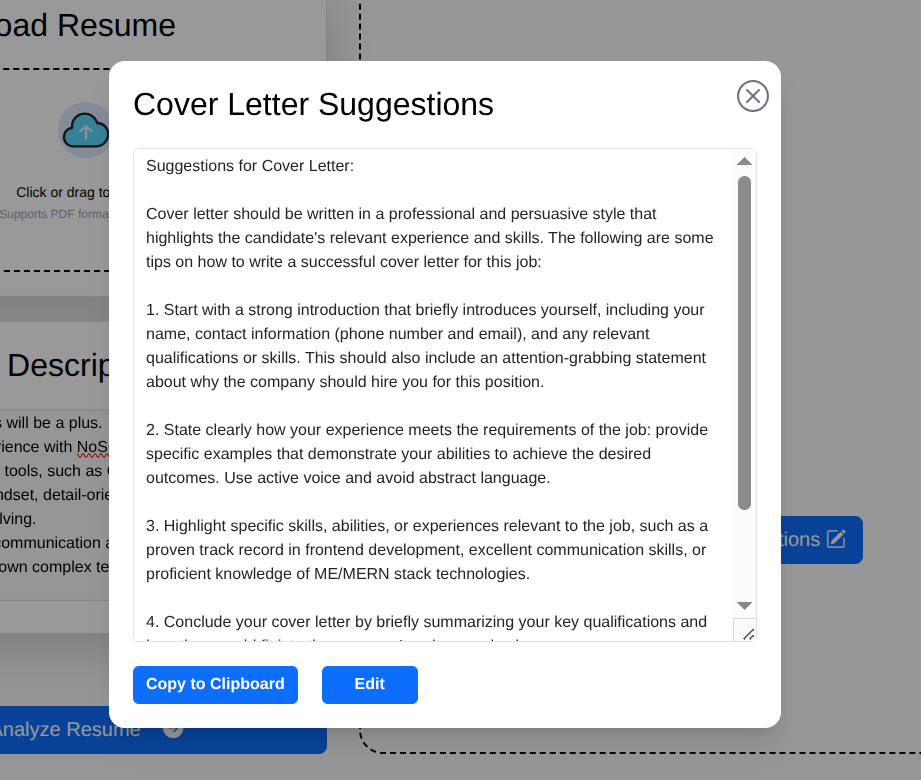

# 🚀 DevApplyAI

DevApplyAI is a full-stack AI-powered job application assistant designed to streamline and automate the job application process. It helps users generate tailored cover letter suggestions, matching score between job description and resume, missing and matching skills.


## 📌 Overview

DevApplyAI is built with AI integration, focusing on improving productivity during job applications. The system provides an interactive UI and backend services to process user input and generate meaningful outputs.


## 🛠️ Tech Stack

### Frontend
- NextJs
- Bootstrap

## 🎥 Demo Video

[▶️ Watch Demo Video](https://www.youtube.com/watch?v=naogP2kXhk8)

## ⚙️ Features
- Shows missing skills in the resume from job description.
- Shows similarity score between resume and job description.
- Based on the job desccription and resume, it provide some suggestions to write **cover lettter**.
- 🤖 AI-powered processing (via Transformers / Torch ecosystem)  
- 🌐 Async-ready architecture  


## 🎯 Use Cases
- Students applying for internships.
- Developers applying for jobs.
- Automating repetitive job application tasks


## 🚧 Problems Faced During Development:
1. pdf-parse is incompitalbe with nextjs.   
- When extracting resume text, pdf-parse package was not working properly with nextjs. Importing this way "import pdfParse from "pdf-parse";" was no longer had a default export in its latest ESM version.
- "import * as pdfParse from "pdf-parse";" importing this way also shows "The export default was not found in module [project]/node_modules/pdf-parse/dist/pdf-parse/esm/index.js [app-route] (ecmascript)."  
**Soln :** Then used pdf2json package for resume text extraction.


2. Cover Letter card was fetching cover-letter text.  
 **Cause:** In Next.js development mode, useEffect is triggered twice.  
 **Soln :** Guard the useEffect for the second API call.  
    ```const hasFetched = useRef(false);  
    useEffect(() => {  
        if (hasFetched.current) return;  
        hasFetched.current = true;  
        generateCoverLetter();  
    }, []);```


## 📸 Screenshots






## 👨‍💻 Author

**Md Mahdi Hasan Tazelly**

## ⭐ Support

If you find this project useful, consider giving it a ⭐ on GitHub!